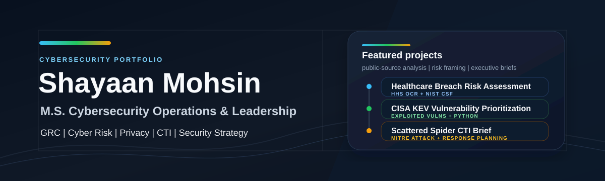

  

# Shayaan Mohsin

**M.S. Cybersecurity Operations and Leadership**  
GRC | Cyber Risk | Privacy | CTI | Security Strategy

I build evidence-backed cybersecurity work that connects public threat and risk data to practical decisions: what matters, why it matters, who needs to act, and how progress should be tracked.

My current focus is Governance, Risk, and Compliance (GRC), cyber risk, privacy, vulnerability prioritization, Cyber Threat Intelligence (CTI), and security strategy. I am especially interested in work that turns frameworks, advisories, breach data, and threat intelligence into executive-ready recommendations.

## Featured Work

| Project | What It Shows | Evidence Base |
|---|---|---|
| [Healthcare Breach Risk Assessment](https://github.com/shayaan-mohsin/cybersecurity-portfolio/tree/main/projects/01-nist-csf-risk-assessment) | GRC analysis, NIST CSF 2.0 mapping, risk register, roadmap, executive brief | HHS OCR breach records, HHS guidance, NIST CSF 2.0 |
| [CISA KEV Vulnerability Prioritization](https://github.com/shayaan-mohsin/cybersecurity-portfolio/tree/main/projects/02-cisa-kev-vulnerability-prioritization) | Exploited vulnerability triage, SLA matrix, Python workflow, weekly vulnerability brief | CISA KEV CSV/JSON feeds, CISA BOD 22-01 |
| [Scattered Spider CTI Brief](https://github.com/shayaan-mohsin/cybersecurity-portfolio/tree/main/projects/03-mitre-attack-cti-brief) | ATT&CK mapping, identity-risk analysis, detection/response planning, executive summary | CISA AA23-320A, MITRE ATT&CK G1015 |

## Portfolio Hub

The full portfolio is managed in one public repository:

[cybersecurity-portfolio](https://github.com/shayaan-mohsin/cybersecurity-portfolio)

It includes project-management artifacts as well as the technical deliverables:

- sprint roadmap and backlog
- public-source methodology notes
- risk registers and executive summaries
- Python analysis workflow
- ATT&CK Navigator layer
- final public-content review

## How I Approach Security Work

| Principle | What That Looks Like |
|---|---|
| Evidence first | Use public datasets, official advisories, and authoritative frameworks before making recommendations. |
| Risk in plain language | Translate technical findings into business impact, ownership, priority, and next steps. |
| Framework-aware | Use NIST CSF 2.0, CISA guidance, MITRE ATT&CK, and vulnerability intelligence as practical tools, not buzzwords. |
| Project-managed | Track scope, deliverables, evidence status, and review points so security work can actually move. |
| Public-safe | Keep work original, sanitized, and clearly bounded without implying access to private systems. |

## Current Focus

- Building stronger GRC and cyber risk case studies
- Practicing CTI writing and ATT&CK mapping
- Improving vulnerability prioritization workflows
- Turning security analysis into executive-ready communication
- Expanding practical DFIR and cloud/SaaS security knowledge

## Tools And Concepts

`NIST CSF 2.0` `CISA KEV` `MITRE ATT&CK` `HHS OCR Breach Portal` `GRC` `Risk Registers` `Executive Briefs` `Vulnerability Prioritization` `CTI` `Incident Response Planning` `Python`

## Connect

LinkedIn: [linkedin.com/in/ShayaanM](https://www.linkedin.com/in/ShayaanM)
